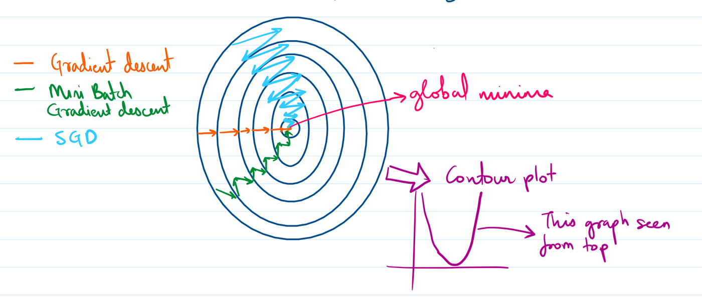

<h1 align="center">Hi 👋, I'm Jyotsan</h1>
<h3 align="center"> AI Engineer</h3>

  
  
    

---

  

## 🎯 Current Focus

  

- 🔭 **Working on:** Multi-Agent Network Architecture
- 🌱 **Learning:** Kubernetes & Container Orchestration  
- 🤝 **Open to collaborate on:** LLM, Langchain, LangGraph, NLP, CV Projects
- 💡 **Seeking help with:** Search Engine Optimization
- 💬 **Ask me about:** ANN, CNN, OCR, ML, BERT, GPT
- 📫 **Reach me:** hamaljyotsan@gmail.com
- ⚡ **Fun fact:** Huge fan of open-world RPGs like Skyrim, The Witcher 3, Ghost of Tsushima!

---
## 🏆 LeetCode Journey

  
  
  

---

<h3 align="left">Connect with me:</h3>

<h3 align="left">Compete with me:</h3>

  
  

<h3 align="left">Languages and Tools:</h3>

 
 

 

 
 
 

 
 
 
 
 
 
 
 
 

## 📊 GitHub Analytics

  
  <table>
    <tr>
      <td>
        
      </td>
      <td>
        
      </td>
    </tr>
  </table>
  
  
  

  <table>
    <tr>
      <td align="center">
        
      </td>
      <td align="center">
        
      </td>
      <td align="center">
        
      </td>
      <td align="center">
        
      </td>
    </tr>
  </table>

